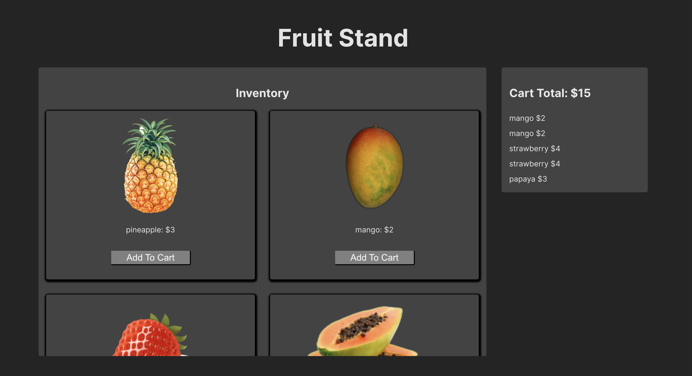

# Has Many / Belongs To

**Table of Contents:**
- [Short Response](#short-response)
- [Overview](#overview)
  - [User Stories](#user-stories)
  - [Starting Code](#starting-code)
  - [Your Task:](#your-task)
- [Part 1: Cart Item](#part-1-cart-item)
- [Part 2: Shopping Cart Instance Properties/Methods](#part-2-shopping-cart-instance-propertiesmethods)
- [Part 3: Shopping Cart Class Properties/Methods](#part-3-shopping-cart-class-propertiesmethods)

## Short Response

Do them! There are only 3 questions

## Overview

In this assignment, you will be tasked with completing the data management portion of an application.

### User Stories 

Upon completing this assignment, the user should be able to:
* Browse a list of fruits available for purchase
* Click on a fruit to add it to their cart
* See the total price of all items in their cart
* Click on an item in the cart to remove it.

### Starting Code

> Remember to run `npm i` to install the dependencies!

To start this assignment, you will be given a Vite project with all rendering and user event logic implemented for you in the `vite-project` folder! Check out what you are starting with by running `npm run dev` and then browsing through the `src/main.js` file and the `src/utils/` folder.

Your job is to build the two classes:
* `ShoppingCart` in the `src/model/ShoppingCart.js` file
* `CartItem` in the `src/model/CartItem.js` file

Only the `ShoppingCart` class is directly used by the rest of the application (see `src/main.js` and `src/utils/render-functions.js`). However, the `CartItem` class must be used by the `ShoppingCart`. 

### Testing...

Below, you will find descriptions of the classes you need to build however, you should read the test files carefully to see how we expect each class to behave. We recommend having the `ShoppingCart.spec.js` and `CartItem.spec.js` files open while you develop.

As you work, use `npm run test:w` to have the test file continuously re-run as you update your code. 

Before you finish, run the program (`npm run dev`) to ensure that your classes provide a usable interface for the rest of the application. Check the user stories above and make sure that the user is able to actually use this application.

**Reminder**: We are using ES Modules!

Because we are using ES Modules and working in the front end, you cannot test your files individually in Node (the terminal in VS code or otherwise). Make sure that you are using the console in the browser when playing with your code.

Let's get started! You got this!

## Part 1: Cart Item

Below you will find requirements for each class. You can test your class using `npm test` or `npm run test:w`

The instructions here are intentionally vague. Look at the associated `CartItem.spec.js` files to see how we are using your class!

Create a `CartItem` class.

It should have the following instance properties:
- `id`: a unique value generated from the getId helper function
- `name`: the given name of the item
- `price`: the given price of the item

## Part 2: Shopping Cart Instance Properties/Methods

Create a `ShoppingCart` class.

Each `ShoppingCart` instance should have the following properties:
- `id`: a unique value generated from the getId helper function (it should not be private)
- `#cartItems`: a **private** array of `CartItem`s held by the `ShoppingCart` instance

Each `ShoppingCart` instance should have the following methods:
- `createItem(name, price)`: creates a new CartItem and adds it to the instance's cart
- `getItems()`: returns the array of items held by this `ShoppingCart` instance
- `removeItem(id)`: removes an item from the instance's cart based on the given id
- `getTotal()`: returns the total price of all itesm held by this `ShoppingCart` instance

## Part 3: Shopping Cart Class Properties/Methods

The `ShoppingCart` class should have the following `static` properties:
- `#allCarts`: a private array of all `ShoppingCart` instances

The `ShoppingCart` class should have the following `static` methods:
- `listAll()`: returns a copy of the array of all `ShoppingCart` instances 
- `findBy(id)`: returns the `ShoppingCart` instance with the given `id`

